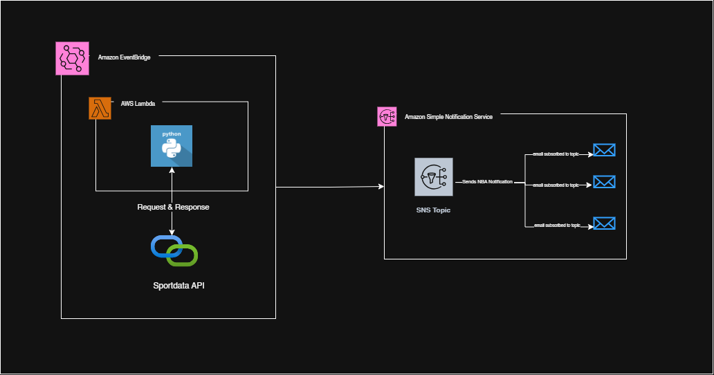

# DAY 2: AUTOMATING REAL-TIME NBA SCORE ALERT

This is a basic cloud project where the game schedule for NBA games are continually fetched through API and the result are being sent directly to your preferred Email.

## TECHNOLOGIES USED

In this project we will be making use of the following:

### AWS Services

- AWS SNS: This is the brain behind sending the mail/sms. It processes data and route it through one of its numerous integrated systems to send result to users.
- AWS Lambda: this is a serverless function by AWS. It allows you to run lines of code without having to create a dedicated servers like EC2 to run it. Our code will be written in Python for this challenge
- AWS EventBridge: This is like the machine that drives the running of the lambda code at interval. It runs the cron job that triggers the Lambda code to be executed based on the condition specified by the administrator
- Sportdata API: This is the intermediary between the user and the server on which the NBA games information is stored. It fetches our data for us

### Python 3.x

### Sportdata API

## ARCHITECTURE



## FEATURES

- Customizable notification
- Scalable Framework for both small scale and enterprise: with little tweak, this could be adopted to an enterprise infrastructure (e.g. bank sending update to customers when money enter their account, account setup completion mail, Monthly summary of an action/account)
- Real-Time Update via Email: This could also be tweaked to send via SMS
- DevOps automation: This is fully automated as the Lambda function will be triggered to be executed at interval

## GETTING STARTED

## Setup SNS

Firstly, let's setup the SNS Topic and subscribe our email to the topic

- on AWS console, search for SNS and navigate to the service console
- Click create topic and fill the necessary form (name and display name, )
- After creation of the topic, click the Create subscription subscription button.
- under protocol, select email and submit

## Create Policy for SNS

- Navigate to IAM service console and click on the policy button by the side nav
- click create policy
- change from visual to json (under the Policy editor)
- change the json to:

```
{
	"Version": "2012-10-17",
	"Statement": [
		{

			"Effect": "Allow",
			"Action": "sns:Publish"
			"Resource": "YOUR_SNS_TOPIC_ARN"
		}
	]
}

```

## Set up the role for Lambda

- While still in the IAM console, click the role link and then proceed to create role
- select AWS SERVICE as trusted entity type
- Use case: Lambda
- Next
- for permission, add the policy created in the previous section. Also add lambdabasicexecutionrole

## Setup Lambda

- Navigate to lambda console
- create new function
- Use Author from scratch
- set the basic details (name, runtime=python3)
- Under execution role, choose USE AN EXISTING ROLE
- Select the role created in previous section
- click create function button

## CODE AND TEST

Now here is where you write the logic that fetches the details from the API and send to SNS

- Write your code in the vscode editor on your screen (check repo for code)
- set the environment variables
- test your code
- deploy and check your email for notification

## AWS EventBridge

This will cater for the running of the code at interval. For each trigger, you'll get the notification with the result of the API query.

- setup the event
- put the cron job logic to specify how many times per hour it should trigger the lambda to run the function.
- This completes the whole process

## CLEANUP AND HOUSE KEEPING

Dont forget to stop and delete all services created to avoid incuring unnecessary charges

## LESSON AND TAKE-HOME IMPORTANCE.

- Notifications could become redundant and users will start hissing rather than being happy when the frequency of the notification is not limited to when only improtant changes has occured or for the notification to only be sent at an appropriate time.
- Like all other tools, all the services used here are important and powerful to get a specific task done. These services should be view in that way rather than limiting it to what we use it for in this project.
  For instance: - SNS: This should always come to our mind when a project needs the functionality to send an information to users. That doesn't mean the project will be utilizing Lambda or other services used here.
